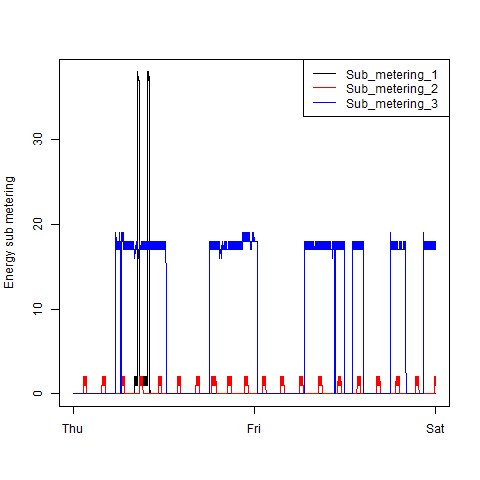
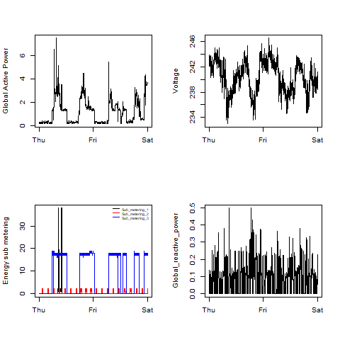

## Introduction

This assignment uses data from
the <a href="http://archive.ics.uci.edu/ml/">UC Irvine Machine
Learning Repository</a>, a popular repository for machine learning
datasets. In particular, we will be using the "Individual household
electric power consumption Data Set" which I have made available on
the course web site:


* <b>Dataset</b>: <a href="https://d396qusza40orc.cloudfront.net/exdata%2Fdata%2Fhousehold_power_consumption.zip">Electric power consumption</a> [20Mb]

* <b>Description</b>: Measurements of electric power consumption in
one household with a one-minute sampling rate over a period of almost
4 years. Different electrical quantities and some sub-metering values
are available.


The following descriptions of the 9 variables in the dataset are taken
from
the <a href="https://archive.ics.uci.edu/ml/datasets/Individual+household+electric+power+consumption">UCI
web site</a>:

<ol>
<li><b>Date</b>: Date in format dd/mm/yyyy </li>
<li><b>Time</b>: time in format hh:mm:ss </li>
<li><b>Global_active_power</b>: household global minute-averaged active power (in kilowatt) </li>
<li><b>Global_reactive_power</b>: household global minute-averaged reactive power (in kilowatt) </li>
<li><b>Voltage</b>: minute-averaged voltage (in volt) </li>
<li><b>Global_intensity</b>: household global minute-averaged current intensity (in ampere) </li>
<li><b>Sub_metering_1</b>: energy sub-metering No. 1 (in watt-hour of active energy). It corresponds to the kitchen, containing mainly a dishwasher, an oven and a microwave (hot plates are not electric but gas powered). </li>
<li><b>Sub_metering_2</b>: energy sub-metering No. 2 (in watt-hour of active energy). It corresponds to the laundry room, containing a washing-machine, a tumble-drier, a refrigerator and a light. </li>
<li><b>Sub_metering_3</b>: energy sub-metering No. 3 (in watt-hour of active energy). It corresponds to an electric water-heater and an air-conditioner.</li>
</ol>


The four plots have been generated as below, the R script is also provided respectively

```ruby

library(data.table)

path <- getwd()

#to extract specific variables from file
featuresWanted <- c("Date","Global_active_power")
dt_activepower <- fread(file.path(path, "data/household_power_consumption.txt"))[, featuresWanted, with = FALSE]

# Change Date Column to Date Type
dt_activepower[, Date := lapply(.SD, as.Date, "%d/%m/%Y"), .SDcols = c("Date")]

#Creating subset by applying criteria of date between 2007-02-01 and 2007-02-02
dt_07Feb_F2D <- subset(dt_activepower, Date >= ("2007-02-01") & (Date <= "2007-02-02"))

#covert "Global_active_power" to numberic 
dt_07Feb_F2D$Global_active_power <- as.numeric(dt_07Feb_F2D$Global_active_power)

png("plot1.png", width=480, height=480)

#Plotting with specific title, X lable, y lable 
hist(dt_07Feb_F2D$Global_active_power, main = "Global Active Power", xlab = "Global Active Power (kilowatts)", ylab = "Frequency", col = "red")

dev.off()
```

### Plot 1


 

```ruby

library(data.table)

path <- getwd()

#to extract specific variables from file
featuresWanted <- c("Date","Time","Global_active_power")
dt_activepower <- fread(file.path(path, "data/household_power_consumption.txt"), na.strings="?")[, featuresWanted, with = FALSE]


# Making a POSIXct date capable of being filtered and graphed by time of day
dt_activepower[, dateTime := as.POSIXct(paste(Date, Time), format = "%d/%m/%Y %H:%M:%S")]


# To apply Filter to keep data between 2007-02-01 and 2007-02-02
dt_activepower <- dt_activepower[(dateTime >= "2007-02-01") & (dateTime < "2007-02-03")]

#covert "Global_active_power" to numberic 
dt_activepower$Global_active_power <- as.numeric(dt_activepower$Global_active_power)


png("plot2.png", width=480, height=480)

## Plot 2
with(dt_activepower, plot(x = dateTime, y = Global_active_power,
                          type = "l", 
                          xlab = "",
                          ylab ="Global Active Power (kilowatts)"))

dev.off()

# Clean enfironment variables
rm(list = ls())
```

### Plot 2

 

```ruby
library(data.table)

path <- getwd()

#to extract specific variables from file
featuresWanted <- c("Date","Time","Sub_metering_1","Sub_metering_2","Sub_metering_3")
dt_EnergyMeter <- fread(file.path(path, "data/household_power_consumption.txt"), na.strings="?")[, featuresWanted, with = FALSE]


# Making a POSIXct date capable of being filtered and graphed by time of day
dt_EnergyMeter[, dateTime := as.POSIXct(paste(Date, Time), format = "%d/%m/%Y %H:%M:%S")]


# To apply Filter to keep data between 2007-02-01 and 2007-02-02
dt_EnergyMeter <- dt_EnergyMeter[(dateTime >= "2007-02-01") & (dateTime < "2007-02-03")]


png("plot3.png", width=480, height=480)

# Plot 3

with(dt_EnergyMeter, plot(x = dateTime
                          ,y = Sub_metering_1,type = "l"
                          ,xlab = ""
                          ,ylab ="Energy sub metering"))

#draw red color line by using ""Sub_metering_2" variable value   
with(dt_EnergyMeter, lines(x = dateTime, y = Sub_metering_2, col = "red" ))

#draw blue color line by using ""Sub_metering_3" variable value   
with(dt_EnergyMeter, lines(x = dateTime, y = Sub_metering_3, col = "blue" ))

#To Create Legend
legend("topright"
       , col=c("black","red","blue")
       , c("Sub_metering_1  ","Sub_metering_2  ", "Sub_metering_3  ")
       ,lty=c(1,1), lwd=c(1,1))


dev.off()

# Clean enfironment variables
rm(list = ls())
```

### Plot 3

 

```ruby
library(data.table)

path <- getwd()

#Loading data from defined file path & file name
dt_poweruse <- fread(file.path(path, "data/household_power_consumption.txt"), na.strings="?")


# Making a POSIXct date capable of being filtered and graphed by time of day
dt_poweruse[, dateTime := as.POSIXct(paste(Date, Time), format = "%d/%m/%Y %H:%M:%S")]


# To apply Filter to keep data between 2007-02-01 and 2007-02-02
dt_poweruse <- dt_poweruse[(dateTime >= "2007-02-01") & (dateTime < "2007-02-03")]

png("plot4.png", width=480, height=480)

# setup plot space for 4 plots
par(mfcol = c(2,2))

#plot 1

with(dt_poweruse, plot(x = dateTime, y = Global_active_power,
                          type = "l", 
                          xlab = "",
                          ylab ="Global Active Power"))

#plot 2
with(dt_poweruse, plot(x = dateTime
                          ,y = Sub_metering_1,type = "l"
                          ,xlab = ""
                          ,ylab ="Energy sub metering"))

#draw red color line by using ""Sub_metering_2" variable value   
with(dt_poweruse, lines(x = dateTime, y = Sub_metering_2, col = "red" ))

#draw blue color line by using ""Sub_metering_3" variable value   
with(dt_poweruse, lines(x = dateTime, y = Sub_metering_3, col = "blue" ))

#To Create Legend
legend("topright", col=c("black","red","blue")
       , c("Sub_metering_1  ","Sub_metering_2  ", "Sub_metering_3  ")
       , lty=c(1,1)
       , bty="n"
       , cex=.5) 


#plot 3
with(dt_poweruse, plot(x = dateTime, y = Voltage,
                       type = "l", 
                       xlab = "",
                       ylab ="Voltage"))

#plot 4
with(dt_poweruse, plot(x = dateTime, y = Global_reactive_power,
                       type = "l", 
                       xlab = "",
                       ylab ="Global_reactive_power"))


dev.off()

# Clean enfironment variables
rm(list = ls())
```
### Plot 4

 

